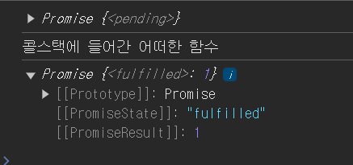
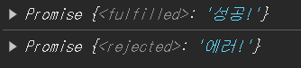
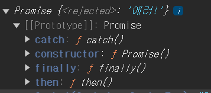
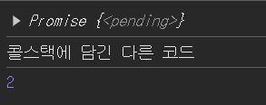
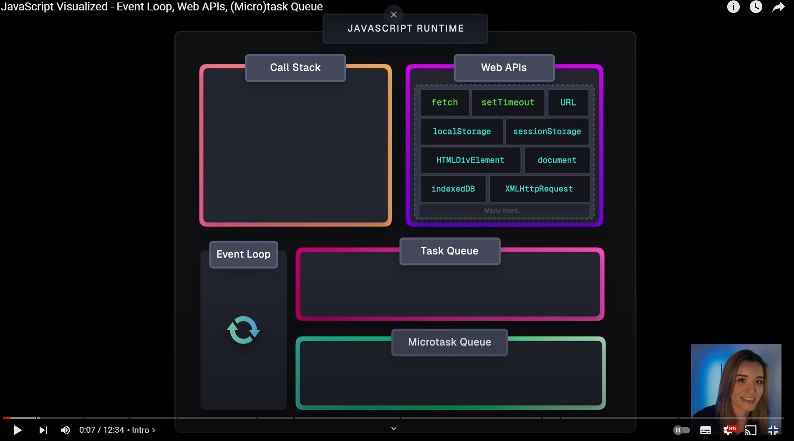
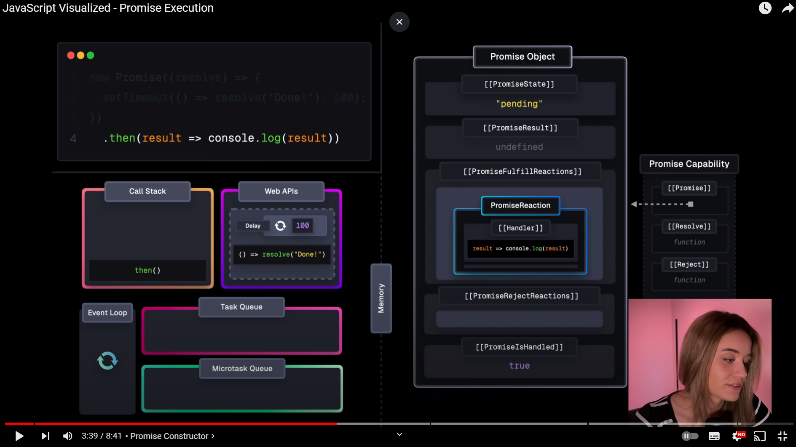
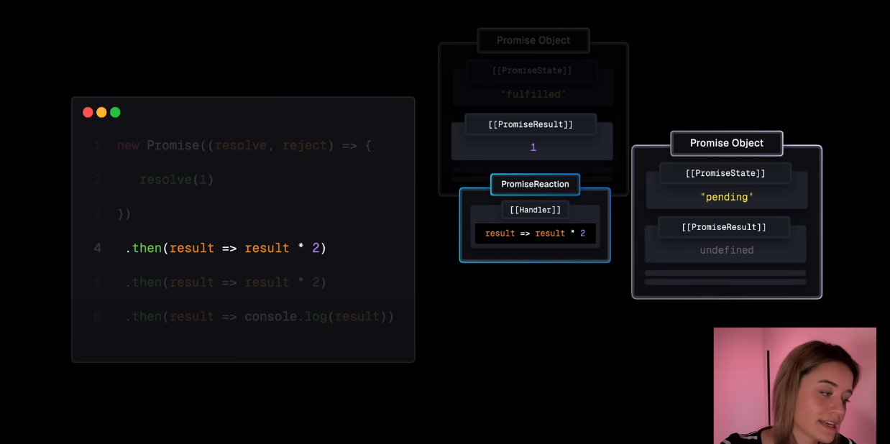
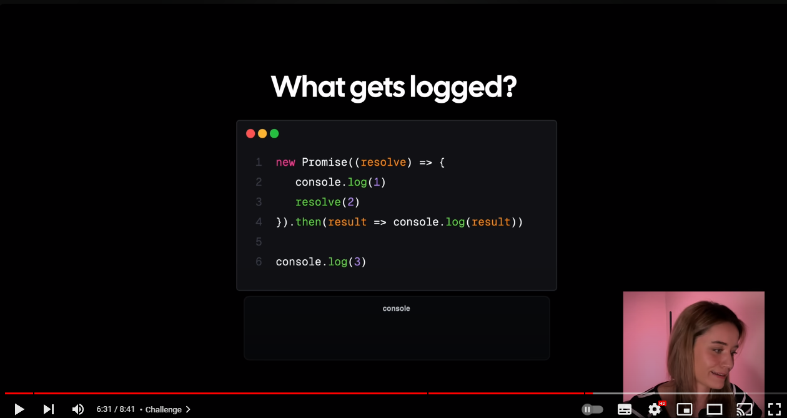

# `Promise` 객체

---

### `Promise` 에 대해 얕게 살펴보기

`Promise` 객체는 `API` 요청을 하다보면 자주 볼 수 있는 객체이다.

`Promise` 객체는 주로 비동기적으로 처리되는 경우들의

결과값을 반환하겠다는 **약속** 을 담은 객체이다.

밑의 예시를 살펴보자

```js
const promise = new Promise((res) => {
  setTimeout(() => {
    res(1);
  }, 1000);
});

console.log(promise);
console.log('콜스택에 들어간 어떠한 함수');
setTimeout(() => {
  console.log(promise);
}, 1000);
```



`promise` 객체는 `1000ms` 이후 응답 값을 받는 `Promise` 객체이다.

자바스크립트의 콜스택은 싱글 스레드이기 때문에 `promise` 객체를 생성한 이후

응답값을 받기 까지 기다리지 않고

하위 항목에 존재하는 `console.log` 들을 차례로 실행해 나간다.

이는 동기적인 처리를 해나가는 콜스택에 익숙한 우리에게 어색함을 느끼게 한다.

**자바스크립트는 싱글 스레드 엔진인데, 그러면 `Promise` 내부에 존재하는 로직은 어디서 처리되지?**

혹은

**아 그러면 `then , catch` 등의 프로미스 핸들러들은 언제 호출되지 ?**

라든지와 같이 말이다.

### `Promise` 객체 조금 더 깊게 살펴보기

---

`Promise` 객체는 위 예시에서 살펴보았듯 내부 슬롯에

`[[PromiseState]] , [[PromiseResult]]` 라는 자료구조를 가지고 있다.

`PromiseState,  PromiseResult` 는 `Promise` 객체 생성 시 요청한 비동기 작업의

처리 결과에 따라 다른 값을 가지게 된다.

#### `[[PromiseState]] , [[PromiseResult]]`

`[[PromiseState]]` 는 3가지 상태를 갖는다.

- `pending` : 아직 비동기 작업 처리가 완료되지 않은 상태
- `fullfiled` : 비동기 작업 처리가 성공적으로 완료된 상태
- `rejected` : 비동기 작업 처리가 실패한 상태

이 때 비동기 작업 처리가 성공 혹은 실패하여 비동기 작업 처리가 모두 마무리 된 상태를

일컫어 `setteled` 라고 하기도 한다.

`[[PromiseResult]]` 에는 `[[PromiseState]]` 가 `pending` 에서 `fullfiled , rejected` 중 한 상태가 되어 비동기작업 처리가 마무리 되었을 때

값이 변경된다.

그러면 `[[PromiseResult]]`의 값은 어떻게 변경시킬까 ?

#### `Promise` 객체 생성하는 방법

```js
Promise(executor: (resolve: (value: any) => void, reject: (reason?: any) => void) => void):
```

프로미스는 다음과 같이 인수로 `excutor` 라는 콜백 함수를 담토록 한다.

`excutor` 콜백 함수엔 또 두가지 콜백함수인 `resolve , reject` 가 담긴다.

각 콜백 함수는 `[[PromiseState]],[[PromiseResult]]` 의 값을 변경시키는 콜백함수로

`resolve` 콜백함수는 `[[PromiseState]]` 를 `fullfiled` 로 변경시키고 `[[PromiseResult]]` 에 `resolve(data)` 에 담긴 `data` 값을 담는다.

`reject` 콜백함수는 `[[PromiseState]]` 를 `rejected` 로 변경시키고 `[[PromiseResult]]` 에 `reject(data)` 에 담긴 `data` 값을 담는다.

```js
const FullfiledPromise = new Promise((res, rej) => {
  res('성공!');
});

const RejectedPromise = new Promise((res, rej) => {
  rej('에러!');
});

console.log(FullfiledPromise);
console.log(RejectedPromise);
```



두 `Promise` 객체의 `[[PromiseState]]` 가 다른 것을 보면 알 수 있다.

### 자바스크립트의 콜스택

---

우리는 처음 자바스크립트의 실행 과정에 대해 공부 할 때 `Call Stack` 에 대해 공부한다.


자바스크립트의 콜스택은 소스 코드가 호출되는 시점에서 해당 코드의 실행 순서에 맞춰

콜스택에 담긴 코드를 실행 단위로 나눈 코드들을 콜스택에 담아나간다.

더 이상 담을 코드가 없을 땐 마지막에 담긴 코드부터 실행해나가며 코드를 실행한다.

```js
const promise = new Promise((res) => {
  setTimeout(() => {
    res(1);
  }, 1000);
});

console.log(promise);
console.log('콜스택에 들어간 어떠한 함수');
```

위 예시의 콜스택은 다음과 같은 과정을 거쳤을 것이다.

`[ empty ] => [promise 객체 생성] => [ empty ] => [console.log(promise<pending>)] => [ empty ] => [console.log('콜스택에 들어간 ..')] => [ empty ]`

위 단계에서 로깅되는 `promise` 객체는 `pending` 된 상태에서 로깅되기 때문에

콜스택에서 `settled` 된 상태의 `promise` 객체를 로깅하기 위해서

`setTimeout` 을 이용하여 로깅했던 모습을 기억 할 수 있다.

```js
setTimeout(() => {
  // promise가 1000ms 이후 settled 되니까
  //  1000ms 이후 로깅
  console.log(promise);
}, 1000);
```

하지만 이는 매우 비효율적이다.

대부분 `Promise` 의 `[[PromiseState]]` 가 언제 변경될지 알 수 없을 뿐더러

`[[PromiseState]]` 의 값이 `fullfiled , rejected` 인지에 따른 분기처리하기 위해

`Promise` 의 내부 슬롯인 `[[PromiseStaet]]` 에 접근 할 수 없기 때문이다.

### `Promise` 객체는 `thenable` 객체

---

`Promise` 객체는 `thenable` 한 객체이다.

`thenable` 이란 `then method` 를 가지고 있는 객체를 의미하는데

실제 `Promise` 의 프로토타입 메소드를 살펴보면 `then` 메소드 뿐이 아니라 다양한 메소드가 존재함을 알 수 있다.



#### `then`

```js
const fullfiledPromise = new Promise((res) => {
  setTimeout(() => {
    res(1);
  }, 1000);
})
  .then((res) => res * 2)
  .then((res) => console.log(res));

console.log(fullfiledPromise);
console.log('콜스택에 담긴 다른 코드');
```



`then` 메소드는 `Promise` 의 `[[PromiseState]]` 가 `fullfiled` 로 변경되었을 때 실행되는 함수이다.

`then` 메소드 내부에 존재하는 파라미터인 `res` 는 `then` 메소드를 호출한 `Promise` 객체의

`[[PromiseResult]]` 의 값을 할당 받으며

`then` 메소드 내부에서 반환된 값이 `[[PromiseResult]]` 에 담긴 새로운 `Promise` 객체를 반환한다.

만약 `then` 메소드에서 반환하는 값이 없을 경우엔 `[[PromiseResult]]` 에 아무런 값도 담기지 않은 프로미스 객체를 반환한다.

#### `catch`

`catch` 메소드는 `[[PromiseState]]` 가 `rejected` 인 `Promise` 객체에서 호출된다.

동작 방식은 `then` 과 유사하며 `[[PromiseState]]` 가 `rejected` 가 아닐 경우엔 호출되지 않는다.

더 자세한 내용은 `MDN` 사이트를 참고하도록 하자

> https://developer.mozilla.org/en-US/docs/Web/JavaScript/Reference/Global_Objects/Promise/catch

### `Promise` 객체와 이벤트 루프

---

```js
const promise = new Promise((res) => res(1)).then((res) => console.log(res));
console.log('dummy');
console.log('dummy');
console.log('dummy');
console.log('dummy');
```

위 예시가 있을 때 로깅되는 값은 어떤 값이 예상될까 ?

위 코드를 살펴보면 `promise` 내부에서 `res(1)` 은 즉각적으로 호출되기 때문에

`[[PromiseState]]`가 변경되어 `1` 이 먼저 로깅 되고 `dummy` 가 로깅 될 것으로 예상된다.

```
dummy
dummy
dummy
dummy
dummy
1
```

하지만 실행 결과는 예상과 달랐다.

그럼 이 경우엔 어떨까 ?

```javascript
setTimeout(() => {
  console.log(2);
}, 0);
const promise = new Promise((res) => res(1)).then((res) => console.log(res));
console.log('dummy');
console.log('dummy');
console.log('dummy');
console.log('dummy');
```

이번엔 `setTImeout` 비동기 처리가 가장 윗단에 추가되었다.

`setTimeout , Promise` 모두 비동기 처리니까 `dummy` 이후에 로깅 될 것이라고

우리는 경험적으로 알고있다.

```dotnetcli
dummy
...
1 // promise 의 로깅값
2 // setTimeout 의 로깅값
```

실행 결과를 보면 `promise` 의 로깅값이 `setTImeout` 의 로깅값보다 먼저 나온 모습을 볼 수 있다.

이러한 이유는 자바스크립트 엔진의 다양한 자료구조 때문에 이런 일이 발생한다.

### `WebAPI`



자바스크립트 엔진은 코드를 실행하기 위해 `Call Stack` 뿐이 아니라 다양한 자료구조를 가지고 있다.

이 중 `WebAPI` 는 비동기적으로 처리되는 코드들을 처리하는 자료구조로

비동기적인 작업인 `API` 호출이나 `setTimeout` 과 같은 코드들이 담긴다.

예를 들어 `setTimeout(() => {} , 1000)` 은 `WebAPI` 자료구조에서 `1000ms` 동안 코드를 담고 있다는 의미를 갖는다.

### `TaskQueue` 와 `MicroTaskQueue`

태스크 큐와 마이크로 태스크 큐는 `WebAPI` 에서 처리된 비동기 작업들이

호출될 준비가 끝나 콜스택으로 옮겨 지기 전 담기는 자료구조이다.

> 자바스크립트 코드가 실행되기 위해선 무조건적으로 자바스크립트 콜스택에 담겨 실행되어야 한다.

`Queue` 자료구조에 맞게 먼저 담긴 순으로 콜스택에 담기며

각 `Queue` 에 담긴 코드들은 콜스택이 모두 비어진 후에 담기게 된다.

이 때 `TaskQueue` , `MicroTaskQueue` 에 모두 값이 존재 할 경우 콜스택이 비면

자바스크립트 엔진은 `MicroTaskQueue` 에 담긴 값을 우선적으로 콜스택에 옮기게 된다.

- `TaskQueue` : `setTImeout , setInterval` 과 같은 타이머 , 네트워크 요청 , `I/O` 이벤트
- `MicroTaskQueue` : `Promise.then  ,catch , finally` 와 같은 프로미스 콜백 , `MutationObserver,`

종류들은 다음과 같다.

```javascript
setTimeout(() => {
  console.log(2);
}, 0);
const promise = new Promise((res) => res(1)).then((res) => console.log(res));
console.log('dummy');
console.log('dummy');
console.log('dummy');
console.log('dummy');
```

위 예시들을 모두 듣고 생각해보면 이해가 확실히 된다.

`setTimeout` 은 호출과 동시에 `TaskQueue` 에 들어가 `console.log(2)` 가 콜스택에 담기길 기다리고 있다.
`new Promise ..` 는 호출과 동시에 `[[PromiseState]]` 가 변경되었고 이에 `then` 메소드는 `MicroTaskQueue` 에 들어가 `console.log(res)` 가 콜스택에 담기길 기다리고 있다.

이후 콜스택에서 차례대로 `dummy` 들이 로깅 된 후엔

`MicroTaskQueue` 에 담긴 `console.log(res)` 가 먼저 실행 된 것이다.

### `then` 메소드들의 호출 시점에 하는 일

---

```js
const promise1 = new Promise((res) => {
  setTimeout(() => {
    res('첫 번째 프로미스 완료!');
  }, 2000);
}).then((res) => console.log(res));

const promise2 = new Promise((res) => {
  setTimeout(() => {
    res('두 번째 프로미스 완료!');
  }, 1000);
}).then((res) => console.log(res));
```

```
// 두 번쨰 프로미스 완료!
// 첫 번쨰 프로미스 완료!
```

`promise1` 은 `promise2` 보다 늦게 `settled` 되지만 먼저 생성되었다.

`settled` 은 `promise1` 이 `promise2` 보단 늦게 되지만 `then` 메소드는 자바스크립트 엔진에 의해 먼저 평가되었을 것이다.

그럼에도 불구하고 먼저 `settled` 된 두 번째 프로미스의 값이 먼저 로깅된다.

이는 `then` 메소드의 호출 시점은 평가되는 시점이 아니라 , 연결된 `Promise` 객체의 `[[PromiseState]]` 가 변경되는 시점이란 것을 알 수 있다.

그럼 자바스크립트 엔진은 `then` 메소드를 평가 할 떄 어떤 일을 하는 것일까 ?



`then` 평가 시점에서 자바스크립트 엔진은

`then` 으로 체이닝 된 `Promise` 객체는 내부 `[[PromiseFullfiledReactions]]` 슬롯에

`then` 내부에 존재하는 핸들러를 `[[Handler]]` 슬롯에 저장한다.

이후 `[[PromiseState]]` 가 `fullfiled` 로 변경된 경우

`[[PromiseFullfiledReactions]]` 내부에 존재하는 `[[Handler]]` 를 마이크로 태스크 큐에 넣은 후 콜스택에서 불러내어 함수를 실행한다.

### `then` 체이닝 시 `Promise` 객체의 변화

```js
const promise1 = new Promise((res) => res(1))
  .then((res) => res * 2)
  .then((res) => res * 2)
  .then((res) => console.log(res));
```

다음과 같은 코드가 있을 때 이벤트 루프에선 어떤 변화가 있을까 ?

위에서 말했듯 `then` 메소드는 본인을 호출한 `Promise` 의 `[[PromiseResult]]` 값을 인수로 받고

`[[PromiseState]]` 가 `fullfiled` 로 변경되었을 때 마이크로태스크 큐를 거쳐서 콜스택에서 실행된다고 하였다.



여러 개의 `then` 메소드들은 자신을 호출한 `Promise` 객체의 `[[PromiseResult]]` 값을 할당 받고

`[[PromiseResult]]` 의 값을 받아 `then` 내부에서 반환하는 값을

`[[PromiseResult]]` 에 담는 새로운 `Promise` 객체를 반환한다.

`then` 메소드 이후 체이닝 되는 여러 `then` 메소드들은 모두 이전에 존재하는 `then` 메소드가 반환하는 `Promise` 객체의 `[[PromiseFullfiledReactions]]` 에 부착된다.

# 마지막 점검

---



해당 `Promise` 가 호출되었을 때의 로깅 되는 값은 무엇일까 ?

나는 사실 처음에 답이

`3 -> 1 -> 2` 인줄 알았다.

하지만 답은 `1 -> 3 -> 2` 이다.

`Promise` 내부에서 `console.log .. resolve(2)` 까지는 모두 호출 시점에서 동기적으로 처리된다.

`resolve(2)` 이후 `Promise` 내부의 `[[PromiseResult , PromiseState]]`의 값은 변경되었다.

이후 `then` 메소드가 호출되며 `then` 내부에 존재하는 로직이 `[[PromiseFullfiledReactions]]` 에 부착 된 후

하위의 `console.log(3)` 을 만나 `3` 이 호출된다.

이후 모든 콜스택이 비게 되면 `[[PromiseFullfiledReactions]]` 에 담긴 핸들러 함수가 콜스택에 담겨 실행되면서 `2` 가 호출된다.

---

웬만한 내용은 해당 유튜브를 참고했는데 정말 멋진 동영상이다.

https://www.youtube.com/watch?v=Xs1EMmBLpn4
